# Database Entity Relationship Diagram (ERD)

This diagram represents the data models and relationships defined in `api/prisma/schema.prisma`.

```mermaid
erDiagram

  %% ─── Marketplace Core ───
  Marketplace {
    BigInt id PK
    String key "Unique (agriculture, commercial, etc)"
    String name
    Boolean isActive
  }

  Category {
    BigInt id PK
    BigInt marketplaceId FK
    BigInt parentId FK
    String name
    String slug "Unique within Marketplace"
    Int sortOrder
  }

  %% ─── Auth ───
  User {
    String id PK
    String email "Unique"
    String role "USER, PRO_SELLER, MANAGER, ADMIN"
    String status "ACTIVE, RESTRICTED, BLOCKED"
    String firstName
    String lastName
  }

  Session {
    String id PK
    String userId FK
  }

  OAuthAccount {
    String id PK
    String userId FK
    String provider
  }

  %% ─── Companies ───
  Company {
    String id PK
    String slug "Unique"
    String name
    String countryId FK
    String cityId FK
    Boolean isVerified
    Boolean isOfficialDealer
    Float ratingAvg
  }

  CompanyUser {
    String userId FK
    String companyId FK
    String role "OWNER, ADMIN, EDITOR"
  }

  CompanyReview {
    String id PK
    String companyId FK
    String authorName
    Int rating
  }

  %% ─── Listings ───
  Listing {
    BigInt id PK
    BigInt marketplaceId FK
    BigInt categoryId FK
    String companyId FK "Optional"
    String ownerUserId FK "Optional"
    String status "DRAFT, ACTIVE, PAUSED, etc"
    String title
    Decimal priceAmount
    String priceCurrency
    String priceType
  }

  ListingMedia {
    BigInt id PK
    BigInt listingId FK
    String type "PHOTO, VIDEO"
    String url
  }

  ListingAttribute {
    BigInt listingId PK, FK
    Json data "Dynamic attributes"
  }

  ListingFact {
    BigInt listingId PK, FK
    Decimal priceAmount
    Int year
    Int mileageKm
    String condition
  }

  ListingWizardState {
    BigInt listingId PK, FK
    Int step
    Json completedSteps
  }

  SellerContact {
    BigInt id PK
    String email
    String name
    String phoneNumber
  }

  ListingSeller {
    BigInt listingId PK, FK
    BigInt sellerContactId FK
  }

  %% ─── Templating ───
  FormTemplate {
    BigInt id PK
    BigInt categoryId FK
    Boolean isActive
  }

  FormField {
    BigInt id PK
    BigInt templateId FK
    String fieldKey
    String fieldType
  }

  FieldOption {
    BigInt id PK
    BigInt fieldId FK
    String value
    String label
  }

  %% ─── Reference Data ───
  Country {
    String id PK
    String iso2
    String name
  }

  City {
    String id PK
    String countryId FK
    String name
  }

  Brand {
    String id PK
    String name
  }

  ActivityType {
    String id PK
    String code
    String name
  }

  %% ─── Messaging & Support ───
  Conversation {
    String id PK
    BigInt listingId FK
    String buyerId FK
    String sellerId FK
  }

  Message {
    String id PK
    String conversationId FK
    String senderId FK
    String body
  }

  SupportTicket {
    String id PK
    String userId FK
    String status
    String priority
  }

  %% ─── Relationships ───

  %% Core
  Marketplace ||--|{ Category : contains
  Category ||--o{ Category : parent
  Category ||--|{ Listing : classifies
  Marketplace ||--|{ Listing : contains

  %% Auth
  User ||--o{ Session : has
  User ||--o{ OAuthAccount : has
  User ||--|{ CompanyUser : member_of

  %% Company
  Company ||--|{ CompanyUser : has_members
  Company ||--|{ Listing : publishes
  Company ||--o{ CompanyReview : receives
  Company }|--|| Country : located_in
  Company }|--o| City : located_in
  Company }|--|{ Brand : deals_in
  Company }|--|{ ActivityType : specializes_in

  %% Listing
  Listing ||--o{ ListingMedia : has_media
  Listing ||--|| ListingAttribute : has_attributes
  Listing ||--|| ListingFact : has_facts
  Listing ||--|| ListingWizardState : tracks_progress
  Listing ||--o| ListingSeller : sold_by
  ListingSeller ||--|| SellerContact : contact_info
  Listing }|--o| Brand : made_by
  Listing }|--o| Country : located_in
  Listing }|--o| City : located_in
  Listing ||--o| User : owned_by

  %% Templating
  Category ||--o{ FormTemplate : has_templates
  FormTemplate ||--|{ FormField : defines
  FormField ||--o{ FieldOption : has_options

  %% Messaging
  Listing ||--o{ Conversation : subject_of
  User ||--o{ Conversation : participates_as_buyer
  User ||--o{ Conversation : participates_as_seller
  Conversation ||--|{ Message : contains
  User ||--|{ Message : sends

  %% Support
  User ||--o{ SupportTicket : opens

```

## Update - 2026-02-17 (Fix_download)
- Implemented Autoline-style template/runtime upgrades: configurable `dataSource`, `dependsOn`, `visibleIf`, `requiredIf`, `resetOnChange`, and template block attachments.
- Added full Autoline motorized template inventory (41 fields) as the shared system block for all motorized categories (cars, trucks, tractors, harvesters, excavators, loaders), synced seed and runtime schema, and updated checkbox-group API validation compatibility.
- Added reusable `engine_block`, category-level `hasEngine`, and inheritance/fallback rules so new subcategories keep full details instead of losing engine-related fields.
- Added persistent "create new option" flows and APIs for `brand`, `model`, `subcategory`, `country`, and `city`, so new values are saved once and reused by all users.
- Added options/cascade runtime behavior: parent-change child reset, dependency-based option loading, and dependency-state caching.
- Completed validation checks and build/test verification; local infrastructure (Postgres/Redis/MinIO) confirmed working for this flow.
